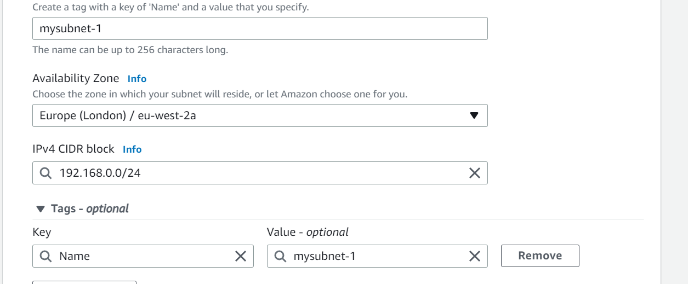

TERRAFORM
-----------

### how to maintaining version in terraform


### how to create a REGION,VPC and SUBNET
#### manul steps


### FROM TERRAFORM
```yml

provider "aws" {
  region = "eu-west-2"
}
resource "aws_vpc" "vpc" {
  cidr_block = "192.168.0.0/16"
  tags = {
    Name = "vpc"
  }
}

resource "aws_subnet" "subnet" {
  vpc_id     = aws_vpc.vpc.id
  cidr_block = "192.168.0.0/24"
  tags = {
    Name = "subnet"
  }
}

```
Now we have to follow below command
### terraform init : Intitalising the provider


### terraform fmt : check the alignment correct ot not

### terraform validate: your syntax is correct or not

### terraform plan: it will shows preview what you want creating after the apply creating resources


### terraform apply : it will creating infrastruture


### terraform apply -auto-approve :what you want creating resources before.it will not asking yes or no . directly creating infrastruture

### terraform destroy: destroying or deleting the infrastruture

### letus check cloud in your region it will creating resources or not


## we have to create ONE VPC and THREE SUBNETS

### create VPC


### create three SUBNETS with attached VPC




### successfully creating three Subnents with attached  After we were created VPC


### IN TERRAFORM

#### Order of execution in `terraform init,fmt,validate,plan,apply`


#### let'us check it will creating or not in my cloud


 ####  letus delteing my resources
  
  
  

### you can observe it will ask your deleting your resources `yes or no`
  
### letus check my resources it was deleted or not in my cloud

  


## VARIBLES

### how to pass the varible
####  main.tf
```yml 
provider "aws" {
  region = var.region
}

resource "aws_vpc" "ntier" {
    cidr_block = var.ntier_vpc_range
    tags = {
        Name = var.ntier_vpc_name
    }
  
}


resource "aws_subnet" "subnet1" {
  vpc_id     = aws_vpc.ntier.id # implicit dependecies
  cidr_block = var.ntier_sunbet1_range
  availability_zone = "${var.region}${var.second_availability_zone}"
  tags = {
    Name = var.ntier_tag1_name
  }
}

resource "aws_subnet" "subnet2" {
  vpc_id     = aws_vpc.ntier.id  # implicit dependecies
  cidr_block = var.ntier_subnet2_range
  availability_zone = "${var.region}${var.second_availability_zone}"
  tags = {
    Name = var.ntier_tag2_name
  }
}

resource "aws_subnet" "subnet3" {
  vpc_id     = aws_vpc.ntier.id   # implicit dependecies
  cidr_block = var.ntier_subnet3_range
  availability_zone = "${var.region}${var.third_availability_zone}"
  tags = {
    Name = var.ntier_tag3_name
  }
}

```

#### inputs.tf

```yml

variable "region" {
    type = string
    default = "eu-west-2"
    description = "region to create rources"
  
}

variable "ntier_vpc_range" {
    type = string
    default = "10.10.0.0/16"
    
    description = "Vpc cidr Range"
  
}

variable "ntier_sunbet1_range" {
  
  type = string
  default = "10.10.0.0/24"
  description = "Subnet1 cidr range"
}

variable "ntier_subnet2_range" {
    type = string
    default = "10.10.1.0/24"
    description = "subnet2 cidr range"
  
}


variable "ntier_subnet3_range" {
    type = string
    default = "10.10.2.0/24"
    description = "subnet3 cidr range"
  
}

variable "ntier_vpc_name" {
    type = string
    default = "vpc"
    description = "vpc tag name"
  }

variable "ntier_tag1_name" {
    type = string
    default = "subnet1"
    description = "subnet1 tag name"
  
}

variable "ntier_tag2_name" {
    type = string
    default = "subnet2"
    description = "subnet2 tag name"
  
}

variable "ntier_tag3_name" {
  type = string
  default = "subnet3"
  description = "subnet3 tag name"
}

variable "first_availability_zone" {
    type = string
    default = "a"
  
}

variable "second_availability_zone" {
    type = string
    default = "b"
  
}

variable "third_availability_zone" {
    type = string
    default = "c"
  
}

```

#### values.tf

```yml
region = "us-east-1"
ntier_vpc_range = "192.168.0.0/16"
ntier_sunbet1_range = "192.168.0.0/24"
ntier_subnet2_range = "192.168.1.0/24"
ntier_subnet3_range = "192.168.2.0/24"

```


