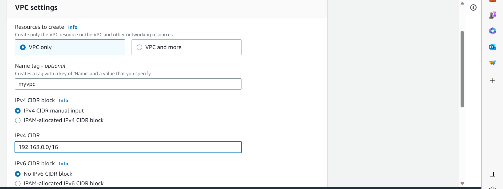
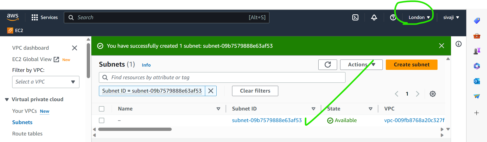
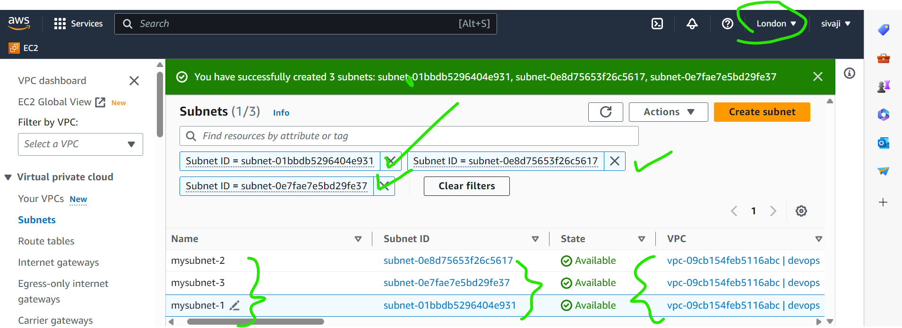
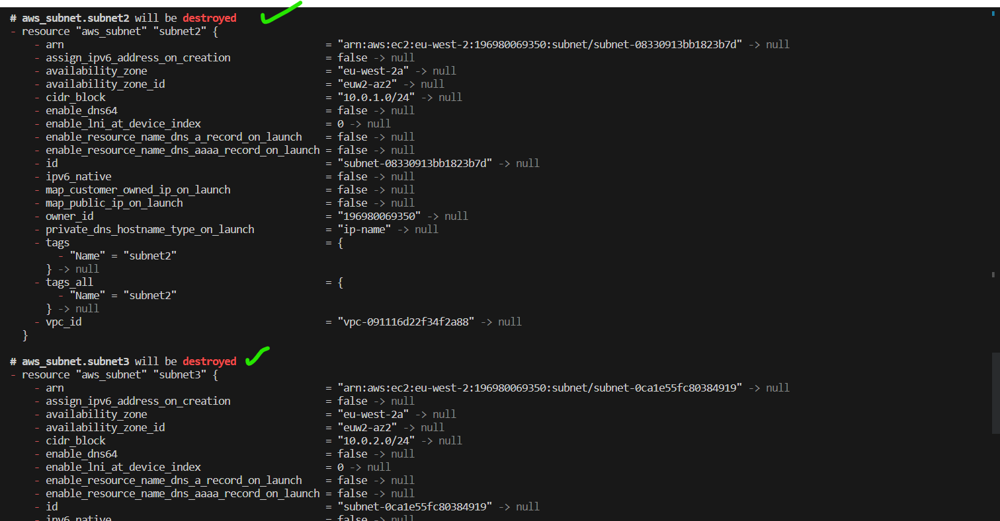
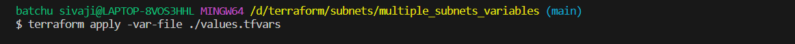
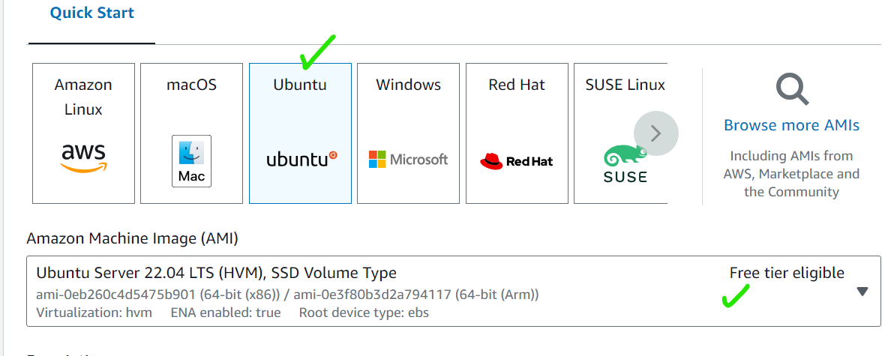

TERRAFORM
-----------

### how to maintaining version in terraform
[[click here]](required_version/version.tf)

### how to create a VPC and SUBNET
#### manul steps

### FROM TERRAFORM
[[click here]](vpc)
* Now we have to follow below command
### terraform init : Intitalising the provider

### terraform fmt : check it alignment correct or not

### terraform validate: your syntax is correct or not

### terraform plan: it will shows preview what you want creating after the apply creating resources

### terraform apply : it will creating infrastruture

### terraform apply -auto-approve :what you want creating resources before.it will not asking yes or no . directly creating infrastruture

### terraform destroy: destroying or deleting the infrastruture

### letus check cloud in your region it will creating resources or not

## we have to create ONE VPC and THREE SUBNETS

### create VPC

### create three SUBNETS with attached VPC

### successfully creating three Subnents with attached  After we were created VPC

### from TERRAFORM
[[click here]](subnets/multiple_subnets/)
#### Order of execution in `terraform init,fmt,validate,plan,apply`

#### let'us check it will creating or not in my cloud

 ####  letus delteing my resources
  
  
  

### you can observe it will ask your deleting your resources `yes or no`
  
### letus check my resources it was deleted or not in my cloud

  

## VARIBLES

### how to pass the varible
[[click here]](subnets/multiple_subnets_variables/)

### Count function
[[click here]](count_function)

### length fuction and cidr subnet
[[click here]](length_function&cidrsubnet_network_function)

### create private and public subnets
[[click here]](private&public_subnets)

### security group reusability
[[click here]](aws-reusability-securitygroup)

### create instance
#### manual steps
[[click here]](instance)

### from terraform

## create Data base instance
 ### manual steps
 
 
 
 
 
 

### from terraform 

